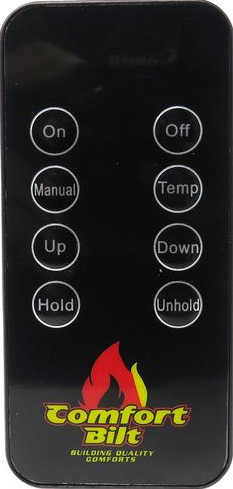

# Comfortbilt HP22 Remote / LIRC Config
LIRC config and scripts to simulate the IR remote of a Comfortbilt HP22 stove.

I use this with the following setup:
- [Raspberry Pi 3 Model B+](https://www.raspberrypi.com/products/raspberry-pi-3-model-b-plus/)
- [ANAVI Infrared pHAT](https://anavi.technology/#products)
- [Zerotier](https://www.zerotier.com) for remote network access
- iOS shortcuts using SSH for triggering via the phone

## LIRC Key Mappings

| Remote | LIRC             |
|--------|------------------|
| ON     | KEY_TOUCHPAD_ON  |
| OFF    | KEY_TOUCHPAD_OFF |
| MANUAL | BTN_0            |
| TEMP   | BTN_1            |
| UP     | KEY_UP           |
| DOWN   | KEY_DOWN         |
| HOLD   | BTN_2            |
| UNHOLD | BTN_3            |